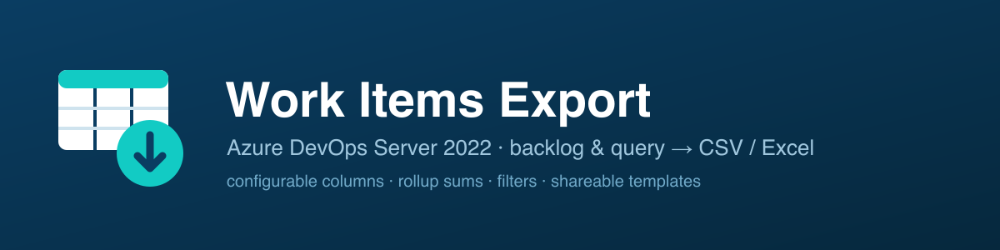

<p align="center">
  
</p>

<h1 align="center">Work Items Export</h1>

<p align="center">
  A VSIX extension for <b>Azure DevOps Server 2022 (on-premises)</b> that exports a team
  <b>backlog level</b> or a <b>saved query</b> to <b>CSV</b> or <b>Excel</b> — with a
  configurable column set, native-style filters, rollup sums, and shareable templates.
</p>

<p align="center">
  <a href="https://github.com/skensell201/AzureDevOps_Work_Items_Exporter/actions/workflows/ci.yml"></a>
  
  
  
  
  
</p>

---

## Why

Azure DevOps Server's backlog has no "export to file" action, and the columns that matter
most — the **"Sum of …" rollup columns** — are computed live in the UI and never stored on
the work item. **Work Items Export** adds a Boards hub that renders the backlog (or a query)
itself, so *what you see is exactly what you download* — including rollups, hierarchy, and
your chosen columns.

It is **read-only** (scopes `vso.work`, `vso.project`, `vso.identity`) and runs entirely in
the browser using the signed-in user's token — it can never modify or damage your data, and
each user only ever sees the projects/work items they already have access to.

## Features

- **Source** — a team **backlog level** (Epics / Features / Stories) or an existing
  **saved query** (My / Shared). The query list is refreshable and expands deep folders.
- **Columns** — pick any process field (including custom fields), with search. Plus
  computed/online columns that aren't stored on the work item:
  - **Sum of `<field>`** rolled up over the descendant subtree, optionally **scoped to a
    work item type** — e.g. *Sum of Task Original Estimate* / *Sum of Task Completed Work*,
    matching the native rollup columns.
  - **Count of children** (all / closed — closed detection is locale-aware).
  - **Parent**, **hierarchy path**, and **level**.
- **Filters** — a native-style filter bar: free-text search plus per-column dropdowns
  (Work Item Type, State, Value Area, Iteration Path, Tags, Assigned To). Filters apply to
  the grid **and** the export ("download what you see").
- **Templates** — save a source + column set as a reusable, named template (optional
  description), reload it in one click, and **share** it with specific collection users.
  A searchable manager keeps it tidy at scale.
- **Export** — CSV (UTF-8 BOM, formula-injection hardened) or Excel (`.xlsx`). Preview
  shows the first 500 rows; the file always contains every matching row.
- **Theme-aware** — adapts to light / dark / high-contrast via Azure DevOps theme variables.

## Install

Build the VSIX and upload it to your collection's local gallery (`{server}/_gallery/manage`),
then install it for the collection. The hub appears under **Boards → Work Items Export**.

```bash
npm install
npm run package   # -> out/local.workitems-export-<version>.vsix
```

Prebuilt `.vsix` files are attached to each [GitHub release](../../releases).

> **Scopes:** `vso.work`, `vso.project`, `vso.identity` (the last powers the template-sharing
> user search). Template storage uses the in-page Extension Data Service, which needs no extra
> manifest scope. Do **not** declare `vso.extension_data` — Azure DevOps Server rejects mixing
> it (a "modern" scope) with the uri-based `vso.*` scopes.

## Usage

1. Open **Boards → Work Items Export**.
2. Choose a **source**: *Backlog* (Project → Team → level) or *Query* (pick a saved query),
   then **Load**.
3. Adjust **Columns** (toolbar popover) — toggle fields, add type-scoped rollup sums.
4. Optionally open the **Filter** bar to narrow the rows.
5. **Download CSV** or **Download Excel** — the file matches the filtered grid.
6. Save the setup as a **Template** to reuse or share it later.

## Templates & sharing

Templates store the source selection + visible columns (never work item data). They are
**personal by default**; the owner can share a template with specific users at any time.
Because sharing requires another user to read it, templates live in the extension's
collection-scoped store and visibility is filtered client-side — this is "soft" privacy
(no per-document server ACL), which is appropriate for an internal admin tool.

## Troubleshooting

- **"Failed to initialize … Error issuing session token: HostAuthorizationNotFound"** — on
  Azure DevOps Server an *in-place update* doesn't refresh the host OAuth authorization, so
  `getAccessToken()` fails. **Fix: fully uninstall the extension, then install the new `.vsix`
  fresh.** A clean install re-creates the host authorization.
- **Stale UI after a new build** — each build emits a content-hashed bundle; a version bump +
  clean install always serves the latest code (no manual cache clearing).
- **A control or column looks off in a theme** — the UI uses Azure DevOps theme variables;
  please open an issue with a screenshot.

## Development

```bash
npm test            # jest (106 tests)
npx tsc --noEmit    # type check
npm run build       # webpack production -> dist/
npm run package     # build + tfx -> out/local.workitems-export-<version>.vsix
```

**Stack:** TypeScript 5, React 16 (pinned by `azure-devops-ui` peer deps), `azure-devops-ui`
(core CSS only), `xlsx`, webpack, jest. `src/hub.tsx` is the only SDK-aware file; everything
else takes an injected `ApiClient` and is unit-tested with fixtures. Pure functions
(`RollupService`, `TableBuilder`, `ExportService`, `filter`) carry most of the test weight.

## How it works

`ExportOrchestrator` ties it together: the source yields work item ids → a recursive WIQL
expands the descendant tree → fields are fetched via `GET _apis/wit/workitems`
(`errorPolicy=omit`, chunked) → `RollupService` computes sums/counts/hierarchy →
`TableBuilder` assembles the table → `filter` narrows it → `ExportService` writes CSV/xlsx.

## Known limitations

- Preview is capped at 500 rows (the downloaded file is not).
- Rollups follow hierarchy (Child) links only.
- "Closed child count" uses the process's `Completed`-category states; if they can't be read
  it falls back to a fixed English set (Closed / Done / Completed).
- Template sharing targets individual users — sharing with a group does not expand to its
  members (add each person individually).
- Tag filter matches a whole tag token (use free-text search for partial matches).

## Contributing

Contributions are welcome — see [CONTRIBUTING.md](CONTRIBUTING.md) for setup, conventions
(TDD, theme-aware styling, read-only scopes), and the PR/release process.

## License

[MIT](LICENSE)
